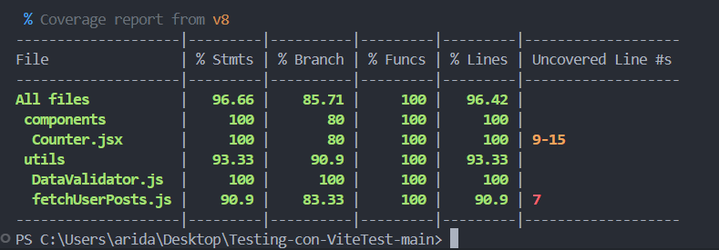

### Ejercicio de test con Vitest

 # Testing Moderno con Vitest y React

> Manual técnico de implementación de pruebas unitarias, de integración e interfaz con **Vitest**, **React Testing Library** y **JSDOM**.

[](https://vitest.dev/)
[](https://react.dev/)
[](https://testing-library.com/)
[](https://github.com/jsdom/jsdom)
[](LICENSE)

---

## Tabla de Contenidos

- [Descripción del Proyecto](#descripción-del-proyecto)
- [Características Principales](#características-principales)
- [Arquitectura del Proyecto](#arquitectura-del-proyecto)
- [Requisitos Previos](#requisitos-previos)
- [Instalación](#instalación)
- [Configuración](#configuración)
- [Estructura del Proyecto](#estructura-del-proyecto)
- [Casos de Uso Implementados](#casos-de-uso-implementados)
- [Ejecución de Tests](#ejecución-de-tests)
- [Metodología AAA](#metodología-aaa-arrange-act-assert)
- [Ejemplos de Tests](#ejemplos-de-tests)
- [Buenas Prácticas](#buenas-prácticas)
- [Recursos y Referencias](#recursos-y-referencias)
- [Autor](#autor)

---

## Descripción del Proyecto

Este proyecto es una **guía técnica de laboratorio** para la implementación de **testing avanzado** utilizando **Vitest** como framework principal, **React Testing Library** para pruebas de componentes, y **JSDOM** como entorno de navegador simulado.

El proyecto está diseñado como material académico para estudiantes de **2DAM (Desarrollo de Aplicaciones Multiplataforma)** en el módulo **PGL (Programación de Dispositivos Móviles)**, proporcionando una base sólida para implementar:

- Pruebas de interfaz (componentes React)
- Pruebas de mocking (simulación de APIs con `vi.spyOn`)
- Pruebas unitarias (lógica de negocio pura)

---

## Características Principales

### Testing de Interfaz

- Renderizado de componentes React con `@testing-library/react`
- Interacción con elementos del DOM (`fireEvent`, `screen.getByTestId`)
- Verificación de estados y renderizado condicional
- Pruebas de límites y casos borde (máximos/mínimos)

### Mocking y Simulación

- Espionaje de funciones globales con `vi.spyOn(global, 'fetch')`
- Simulación de respuestas HTTP exitosas y fallidas
- Verificación de argumentos de llamadas a funciones
- Manejo de casos vacíos y errores de red

### Pruebas Unitarias

- Validación de lógica de negocio pura
- Pruebas de cálculos con precisión decimal
- Verificación de manejo de errores con `toThrow()`
- Casos nominales y casos límite (0%, 100%)

---

## Arquitectura del Proyecto

El proyecto sigue una **arquitectura modular** donde cada archivo fuente en `src/` tiene su correspondiente suite de pruebas en `test/`:

```
src/
├── components/
│   └── Counter.jsx          → Componente visual con estado
├── utils/
│   ├── DataValidator.js     → Lógica de negocio (cálculos)
│   └── fetchUserPosts.js    → Servicio de API (fetch asíncrono)
└── setupTests.js            → Configuración global de testing

test/
├── Counter.test.jsx         → Tests de interfaz
├── DataValidator.test.js    → Tests unitarios
└── UserPosts.test.js        → Tests de mocking
```

---

## Requisitos Previos

Antes de comenzar, asegúrate de tener instalado:

| Herramienta | Versión Mínima | Comando de Verificación |
| ----------- | -------------- | ----------------------- |
| **Node.js** | >= 20.19.0     | `node --version`        |
| **npm**     | >= 8.0.0       | `npm --version`         |

---

## Instalación

### 1. Clonar el repositorio

```bash
git clone https://github.com/Ari-dev-design/Testing-con-ViteTest
cd testing-vitest-react
```

### 2. Instalar dependencias

```bash
npm install
```

### 3. Verificar instalación

```bash
npm run test
```

Si todo está correcto, deberías ver la salida de Vitest ejecutando los tests.

---

## Configuración

### Archivo `vite.config.js`

```javascript
import { defineConfig } from "vite";
import react from "@vitejs/plugin-react";

export default defineConfig({
  plugins: [react()],
  test: {
    environment: "jsdom", // Simula el navegador
    globals: true, // Permite usar describe/it sin importar
    setupFiles: "./src/setupTests.js", // Configuración inicial
    deps: {
      inline: ["/src/utils/UserPostsService.js"], // Solución para imports locales
    },
  },
});
```

### Archivo `src/setupTests.js`

```javascript
import "@testing-library/jest-dom";
```

Este archivo extiende los matchers de Jest para Testing Library, permitiendo el uso de aserciones como `.toBeInTheDocument()`.

### Variables de Entorno

No se requieren variables de entorno para este proyecto de testing, ya que todas las llamadas API son simuladas mediante mocks.

---

## Estructura del Proyecto

```
EJERCICIOTESTINGVITEST/
│
├── node_modules/
├── public/
├── src/
│   ├── components/
│   │   └── Counter.jsx                    # Componente contador con estado
│   ├── utils/
│   │   ├── DataValidator.js               # Función de cálculo de descuentos
│   │   └── fetchUserPosts.js              # Servicio de API con fetch
│   ├── App.css
│   ├── App.jsx
│   ├── index.css
│   ├── main.jsx
│   └── setupTests.js                      # Configuración de Testing Library
│
├── test/
│   ├── Counter.test.jsx                   # Tests de interfaz (Sección A)
│   ├── DataValidator.test.js              # Tests unitarios (Sección C)
│   └── UserPosts.test.js                  # Tests de mocking (Sección B)
│
├── .gitignore
├── eslint.config.js
├── index.html
├── package.json
├── package-lock.json
├── README.md                              # Este archivo
└── vite.config.js                         # Configuración de Vite y Vitest
```

---

## Casos de Uso Implementados

### Sección A: Testing de Interfaz (`Counter.jsx`)

#### Componente Counter

Componente React que implementa un contador con límites y validaciones:

```javascript
// Funcionalidades principales:
- Estado inicial configurable (initialValue)
- Límites máximos y mínimos (maxValue, MIN_VALUE)
- Botones de incremento, decremento y reset
- Indicadores visuales de límites alcanzados
- Deshabilitación automática de botones en límites
```

#### Tests Implementados

| Test       | Descripción                            | Patrón AAA |
| ---------- | -------------------------------------- | ---------- |
| **Test 1** | Renderizado inicial con valor 0        | Completo   |
| **Test 2** | Incremento básico (+1)                 | Completo   |
| **Test 3** | Límite mínimo (no decrementar de 0)    | Completo   |
| **Test 4** | Decremento básico (-1)                 | Completo   |
| **Test 5** | Límite máximo (no superar 10)          | Completo   |
| **Test 6** | Deshabilitar botón al llegar al máximo | Completo   |
| **Test 7** | Deshabilitar botón al llegar al mínimo | Completo   |
| **Test 8** | Resetear contador al valor inicial     | Completo   |

---

### Sección B: Mocking y SpyOn (`fetchUserPosts.js`)

#### Servicio fetchUserPosts

Función asíncrona que consume la API de JSONPlaceholder:

```javascript
// Funcionalidades principales:
- Validación de userId
- Llamada HTTP con fetch
- Manejo de errores de red (404, 500)
- Respuestas estructuradas con count y message
- Manejo de listas vacías
```

#### Tests Implementados

| Test       | Descripción                               | Mock                        |
| ---------- | ----------------------------------------- | --------------------------- |
| **Test 1** | Respuesta exitosa con 2 posts             | `vi.spyOn(global, 'fetch')` |
| **Test 2** | Verificación de argumentos (URL correcta) | `toHaveBeenCalledWith()`    |
| **Test 3** | Simulación de error 500                   | `mockResolvedValue()`       |
| **Test 4** | Manejo de lista vacía                     | `json: async () => []`      |

---

### Sección C: Pruebas Unitarias (`DataValidator.js`)

#### Función calculateDiscount

Función pura que calcula precios con descuentos:

```javascript
// Funcionalidades principales:
- Cálculo de descuento porcentual
- Validación de parámetros (precio > 0, descuento 0-100)
- Redondeo a 2 decimales
- Lanzamiento de errores en casos inválidos
```

#### Tests Implementados

| Test       | Descripción                        | Caso       |
| ---------- | ---------------------------------- | ---------- |
| **Test 1** | Descuento del 20% sobre 100 → 80   | Nominal    |
| **Test 2** | Descuento del 0% → precio original | Borde      |
| **Test 3** | Descuento del 100% → 0             | Borde      |
| **Test 4** | Precio negativo o cero → Error     | Validación |
| **Test 5** | Redondeo a 2 decimales (33.333%)   | Precisión  |
| **Test 6** | Descuento < 0 o > 100 → Error      | Validación |

---

## Ejecución de Tests

### Salida esperada

```
✓ test/Counter.test.jsx (8 tests) 1250ms
  ✓ Counter Component (8 tests) 1248ms
    ✓ debe renderizar el contador con el valor inicial de 0 150ms
    ✓ debe incrementar el contador en 1 al hacer clic 125ms
    ✓ debe mostrar la advertencia de límite mínimo 180ms
    ✓ debe decrementar el contador en 1 142ms
    ✓ no debe permitir incrementar mas alla del valor maximo 165ms
    ✓ debe deshabilitar el boton de incrementar al llegar a 10 138ms
    ✓ debe deshabilitar el boton de decrementar al llegar a 0 152ms
    ✓ debe resetear el contador al valor inicial 198ms

✓ test/DataValidator.test.js (6 tests) 45ms
✓ test/UserPosts.test.js (4 tests) 125ms

Test Files  3 passed (3)
     Tests  18 passed (18)
  Start at  15:30:42
  Duration  1.52s
```

---

## Metodología AAA (Arrange-Act-Assert)

Todos los tests del proyecto siguen el **patrón AAA** para mantener claridad y legibilidad:

### Estructura AAA

```javascript
it("descripción del test", async () => {
  // ARRANGE
  // Configurar el entorno: variables, renderizar componentes
  render(<Counter />);
  const button = screen.getByTestId("btn-incrementar");

  // ACT
  // Ejecutar la acción a probar
  await fireEvent.click(button);

  // ASSERT
  // Comprobar que el resultado es el esperado
  expect(screen.getByTestId("current-count")).toHaveTextContent("1");
});
```

### Ejemplo Real del Proyecto

```javascript
it("debe decrementar el contador en 1 al hacer clic", async () => {
  // ARRANGE
  render(<Counter initialValue={5} />);
  const decrementButton = screen.getByTestId("btn-decrementar");

  // ACT
  await fireEvent.click(decrementButton);

  // ASSERT
  expect(screen.getByTestId("current-count")).toHaveTextContent("4");
});
```

---

## Ejemplos de Tests

### 1. Test de Interfaz (React)

```javascript
it("debe deshabilitar el boton de incrementar al llegar a 10", async () => {
  // ARRANGE
  render(<Counter initialValue={9} maxValue={10} />);
  const btnInc = screen.getByTestId("btn-incrementar");

  // ACT
  await fireEvent.click(btnInc);

  // ASSERT
  expect(screen.getByTestId("current-count")).toHaveTextContent("10");
  expect(btnInc).toBeDisabled();
  expect(screen.getByTestId("max-warning")).toBeInTheDocument();
});
```

### 2. Test de Mocking (API)

```javascript
it("debe devolver 2 posts al simular una respuesta OK", async () => {
  // ARRANGE
  const mockPosts = [
    { userId: 5, id: 1, title: "Post 1" },
    { userId: 5, id: 2, title: "Post 2" },
  ];

  const mockResponse = {
    ok: true,
    status: 200,
    json: async () => mockPosts,
  };

  const fetchSpy = vi.spyOn(global, "fetch").mockResolvedValue(mockResponse);

  // ACT
  const result = await fetchUserPosts(4);

  // ASSERT
  expect(fetchSpy).toHaveBeenCalledWith(
    "https://jsonplaceholder.typicode.com/posts?userId=4"
  );
  expect(result.count).toBe(2);
});
```

### 3. Test Unitario (Lógica de Negocio)

```javascript
it("debe calcular el precio con un descuento nominal del 20%", () => {
  // ARRANGE
  const price = 100;
  const discount = 20;

  // ACT
  const result = calculateDiscount(price, discount);

  // ASSERT
  expect(result).toBe(80.0);
});
```

### 4. Test de Manejo de Errores

```javascript
it("debe lanzar error si el descuento es inválido", () => {
  // ASSERT (directo con expect y toThrow)
  expect(() => calculateDiscount(100, -5)).toThrow();
  expect(() => calculateDiscount(100, 150)).toThrow();
  expect(() => calculateDiscount(-10, 20)).toThrow();
});
```

---

## Buenas Prácticas

### 1. Nomenclatura de Tests

````javascript
// Descripción clara y específica
it("debe deshabilitar el botón de incrementar al llegar al máximo");

### 2. Uso de data-testid

```javascript
// Usar data-testid para elementos críticos
<button data-testid="btn-incrementar">Incrementar</button>;

// Acceder en el test
const button = screen.getByTestId("btn-incrementar");
````

### 3. Aislamiento de Tests

```javascript
// SIEMPRE restaurar mocks después de cada test
afterEach(() => {
  vi.restoreAllMocks();
});
```

### 4. Tests Asíncronos

```javascript
// Usar await con fireEvent en casos complejos
await fireEvent.click(button);

// Usar async/await para funciones asíncronas
const result = await fetchUserPosts(1);
```

### 5. Cobertura de Casos

Para cada funcionalidad, implementar tests para:

- **Caso nominal**: Funcionamiento esperado
- **Casos borde**: Límites (0, máximo, mínimo)
- **Casos de error**: Validaciones y excepciones

---

## Recursos y Referencias

### Documentación Oficial

- [Vitest](https://vitest.dev/) - Framework de testing
- [React Testing Library](https://testing-library.com/react) - Testing de componentes React
- [Vitest API - Expect](https://vitest.dev/api/expect.html) - Matchers y aserciones

### Guías y Tutoriales

- [Testing Best Practices](https://testingjavascript.com/) - Testing JavaScript
- [Common Testing Pitfalls](https://kentcdodds.com/blog/common-mistakes-with-react-testing-library) - Errores comunes

---

## Contexto Académico

**Curso**: 2DAM (Desarrollo de Aplicaciones Multiplataforma)  
**Objetivo**: Implementación de testing moderno con Vitest y React Testing Library

Este proyecto forma parte del material de laboratorio para el aprendizaje de:

- Testing de interfaz con React Testing Library
- Mocking de APIs y funciones globales
- Pruebas unitarias de lógica de negocio
- Metodología AAA (Arrange-Act-Assert)

---

## Autor

**Aridane Quevedo Cabrera**  
Estudiante de 2DAM - Desarrollo de Aplicaciones Multiplataforma

---

## Agradecimientos

- Documentación oficial de Vitest y React Testing Library
- Comunidad de Testing Library
- Profesores del módulo DAD Guillermo por el material de referencia

---

**Última actualización**: Enero 2026
